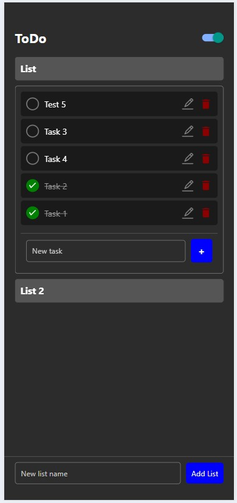

# ToDo App

A simple, yet powerful, cross-platform ToDo application built with **React Native** and **Firebase**. The app allows users to create lists of tasks, mark tasks as done, edit tasks, and delete them with ease. It supports both light and dark mode, and remembers the user's preference. This app works on both mobile devices (via Expo Go) and the web (via React Native for Web).

## Features

- **Create Lists**: Users can create multiple task lists to organize their tasks.
- **Add Tasks**: Add new tasks to each list and keep track of your to-dos.
- **Mark Tasks as Done**: Mark tasks as completed by tapping the round check button.
- **Edit Tasks**: Edit the text of existing tasks.
- **Delete Tasks**: Delete tasks by tapping the trash icon, followed by a confirmation.
- **Light/Dark Mode**: Toggle between light and dark themes, and the app remembers your theme preference.
- **Persistent Data**: All lists and tasks are saved in **Firebase Firestore**, ensuring they persist across sessions.

## Tech Stack

- **React Native**: For building the mobile and web application.
- **Expo**: To manage development and deployment across platforms.
- **Firebase Firestore**: For real-time data storage and synchronization.
- **AsyncStorage**: For persisting theme preferences on mobile devices.
- **React Native Web**: For web support using React Native components.

## Screenshots

## Screenshots




## Installation

To get started with the app on your local machine, follow these steps:

### Prerequisites

- Node.js installed
- Expo CLI installed globally
- Firebase project setup

### Clone the repository:

```bash
git clone https://github.com/yourusername/ToDo-mobile.git
cd todo-app
```

## Install dependencies:

```bash
npm install
```

## Setup Firebase:

1. Create a Firebase project at [Firebase Console](https://console.firebase.google.com/).
2. Add Firebase to your app by creating a new web app in the Firebase console.
3. Copy the Firebase config into a new file named `firebaseConfig.js` in the root of the project.

```js
import { initializeApp } from 'firebase/app';
import { getFirestore } from 'firebase/firestore';

const firebaseConfig = {
  apiKey: 'your-api-key',
  authDomain: 'your-auth-domain',
  projectId: 'your-project-id',
  storageBucket: 'your-storage-bucket',
  messagingSenderId: 'your-messaging-sender-id',
  appId: 'your-app-id',
};

const app = initializeApp(firebaseConfig);
export const db = getFirestore(app);
```

## Run the App
Mobile (Expo Go):
1. Start the development server:
```bash
npx expo start
```
2. Scan the QR code with your mobile device using the Expo Go app.  

Web:
1. Run the web version of the app:
```bash
npx expo start
```
2. run http://localhost:8081/ in your web browser.

## Usage

- **Add a List**: Tap the "Add List" button at the bottom to create a new list.
- **Expand List**: Tap a list to expand and see its tasks.
- **Add a Task**: Enter a task in the input field and press the "+" button to add it.
- **Mark as Done**: Tap the circle next to a task to mark it as done.
- **Edit a Task**: Tap the edit icon next to a task to modify its text.
- **Delete a Task**: Tap the trash icon to delete a task, followed by a confirmation to finalize the deletion.
- **Dark/Light Mode**: Toggle the theme using the switch at the top right corner. Your preference will be saved for future sessions.

## Future Improvements

- **Due Dates & Reminders**: Add due dates to tasks and enable reminders.
- **Priority Levels**: Allow users to assign priority levels to tasks.
- **Collaborative Lists**: Share lists with other users for collaborative task management.
- **Recurring Tasks**: Enable tasks to repeat daily, weekly, or monthly.

## Contributing

Contributions are welcome! Please open an issue or submit a pull request for any changes or new features you'd like to see in the app.
